# Create Free tier Kubernetes Cluster on a IBM Cloud Trial Account

This article discuss the steps to create a Kubernetes cluster and deploy a web application.

## Prerequisites

- An _IBM Cloud account_, to sign up visit [this](https://cloud.ibm.com/registration) site.

## Creating a Kubernetes Cluster

### Steps

1. Log in to IBM Cloud.
2. In the top navigation, select **Catalog**.
   > 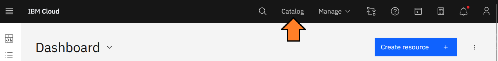
3. Select the category **Containers**.
   > 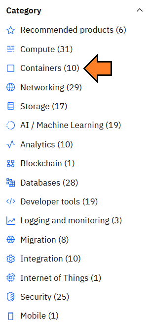
4. Select **Kubernetes Service**.
   > 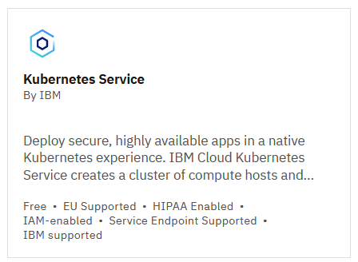
5. Under the _Plan details_ section, select **Free tier cluster**.
   > 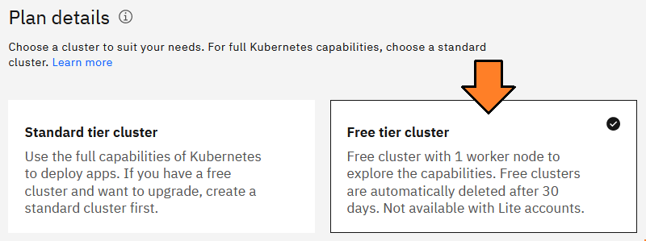
6. Click the **Create** button.
7. The _Overview_ page for the cluster will appear. From here you may monitor the creation process, which will take up to 30 minutes to complete.
8. Once the cluster has been created, green checks will appear across the status tiles.
   > 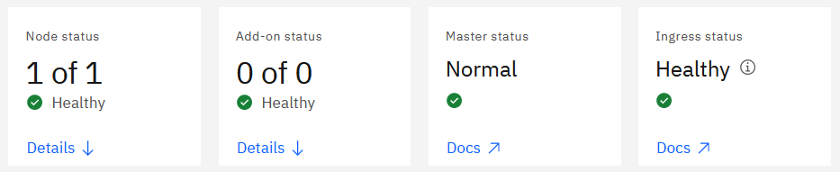

## Accessing the Kubernetes cluster

Once the cluster has been completed

There are several methods available to access the cluster, the following most popular options:

- CLI (ie command line)
- the Kubernetes dashboard

In this article you will use both the **IBM Cloud Shell** and **Kubernetes dashboard**.

## Connect to the IBM Cloud Shell

### Steps

1. In the top navigation, click the button with the **Terminal** icon. A new browser tab opens titled _IBM Cloud Shell_.
   > 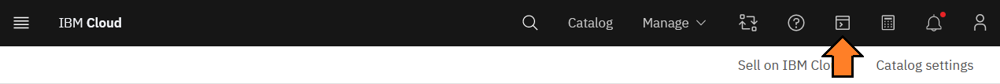
2. Back in our cluster **Overview** tab, select _Actions > Connect via CLI_.
   > 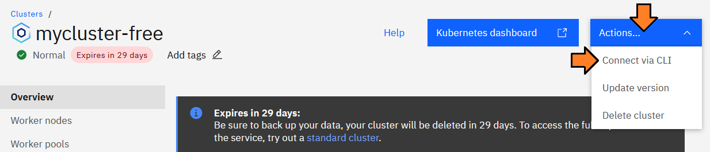
3. In the _Connect to CLI_ dialog, run the referenced 3 commands in the _IBM Cloud Shell_ tab.

   > 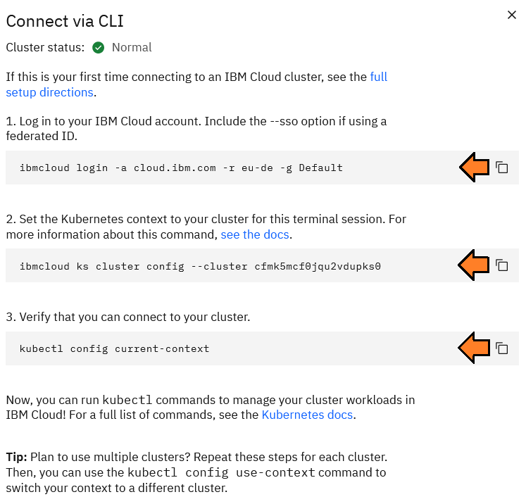

   Example output:

   > 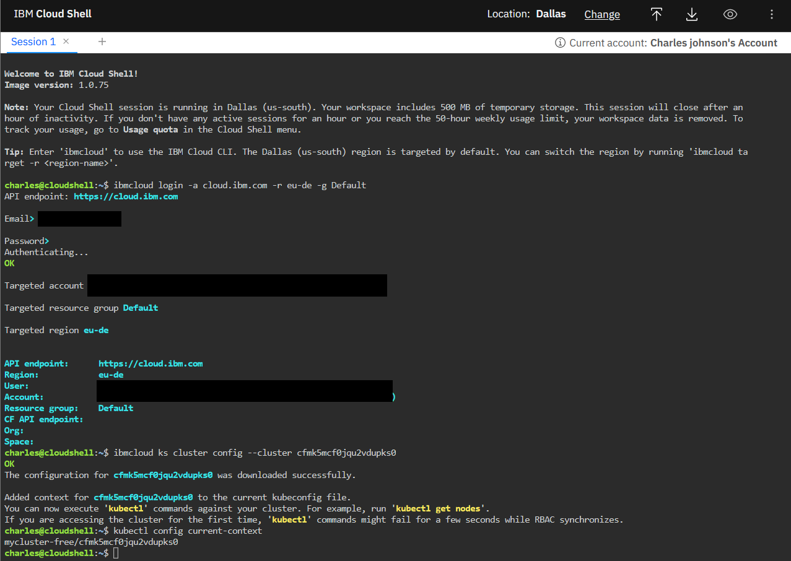

## Connect to the Kubernetes dashboard

### Steps

1. Under the top navigation, click the _Kubernetes dashboard_ button.
   > 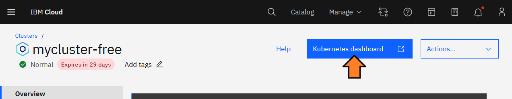
2. A new browser tab opens titled _{cluster name} - Kubernetes dashboard_.

## Accessing Applications Over the Web

By default, the free tier of the Kubernetes lacks features available in the standard cluster.

To provide web access to applications, you will make use of the following:

- The **External-IP** address assigned to the single node in our cluster.
- To provide a hostname to our cluster, we will use [nip.io](https://nip.io/).
  > **Note**: The hostname will be in the format `{External-IP}.nip.io`.
- To provide an ingress to our application you will use [Nginx Ingress Controller](https://docs.nginx.com/nginx-ingress-controller/installation/installation-with-manifests/).
  > **Note**: Since we have a single-node cluster, we will use the _DaemonSet_ deployment option which will bind the ingress controller to the _External-IP_ assigned to the node.

### Steps:

1. To install the **ingress controller**, run the following command:
   ```
   kubectl apply -f https://raw.github.ibm.com/IBM-DEG/IBM-Coding-Challenges-Platform/main/Call-for-Code-Global-Challenge/Skills-Network/CFCCompetitionContents/IBM-Cloud-Kubernetes-Cluster/assets/manifests/nginx-ingress-controller-daemon-v3.0.2.yaml?token=AAABUGPCAUV7GPP56LFWSZ3D7BNOI
   ```
2. To monitor progress, run the following command:
   ```
   kubectl get daemonset -n nginx-ingress
   ```
   Example output:
   ```
   NAME            DESIRED   CURRENT   READY   UP-TO-DATE   AVAILABLE   NODE SELECTOR   AGE
   nginx-ingress   1         1         1       1            1           <none>          24h
   ```
3. To determine the `External-IP` of the node, run the following command:
   ```
   kubectl get nodes -o jsonpath='{.items[0].status.addresses[?(@.type=="ExternalIP")].address}'
   ```
   Example output:
   ```
   169.169.169.169
   ```
4. That's it! When creating an ingress, be sure to use the following **hostname** format:
   ```
   {External-IP}.nip.io
   ```
   Example:
   ```
   169.169.169.169.nip.io
   ```

## Deploying a sample application

In this exercise, you will create an application using the Docker image [nginxdemos](https://hub.docker.com/r/nginxdemos/hello/).

### Steps:

1. Connect to the **IBM Cloud Shell**.
   > **Note**: Refer to the section _Connect to the IBM Cloud Shell_
2. First let's create a new namespace. To do so, run the following command:
   ```
   kubectl create ns callforcode
   ```
3. Let's set `callforcode` as our default namespace. To do so, run the following command:
   ```
   kubectl config set-context --current --namespace=callforcode
   ```
4. Now let's create an application based on the _nginx-demos_ image. To do so,run the following command::
   ```
   kubectl create deployment nginxdemos --image=nginxdemos/hello
   ```
5. To check the status of our deployment, run the following command:
   ```
   kubectl get deployment nginxdemos
   ```
   the output show appear as follows on complete.
   ```
   NAME         READY   UP-TO-DATE   AVAILABLE   AGE
   nginxdemos   1/1     1            1           23h
   ```
6. Now to expose our application, we will Run the following command to expose this application:
   ```
   kubectl expose deployment nginxdemos --type=NodePort --port=8080 --target-port=80 --name=nginxdemos
   ```
7. Open the **Kubernetes dashboard**.
   > **Note**: Refer to the section _Connect to the Kubernetes dashboard_
8. In the top navigation, select the `+` button.
   > 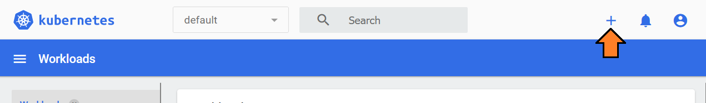
9. Paste in the code below to create an Ingress to make your application accessible on the web.
   > **Note**: On the `host:` line notice the special hostname `{External-IP}.nip.io` with an added prefix.
   ```
    apiVersion: networking.k8s.io/v1
    kind: Ingress
    metadata:
      name: nginxdemos-ingress
    spec:
      rules:
        - host: nginxdemos.169.169.169.169.nip.io
          http:
            paths:
            - path: /
              pathType: Prefix
              backend:
                service:
                  name: nginxdemos
                  port:
                    number: 8080
   ```
   your browser should appear as shown:
   > 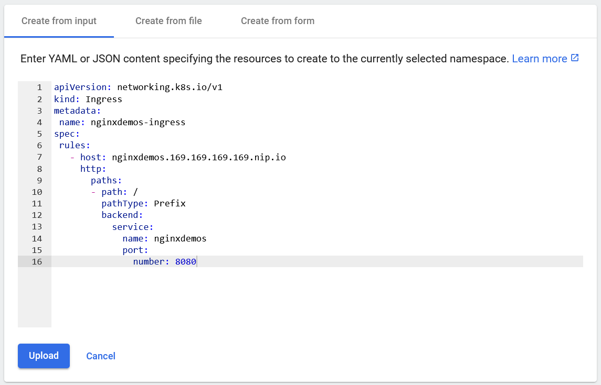
10. Click **Upload**.
11. In the left navigation select **Ingress**.
    > 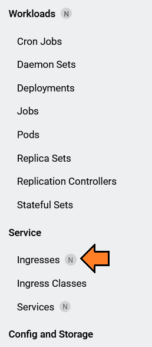
12. The table shows the new ingress and assigned _Host_ to access the application.
    > 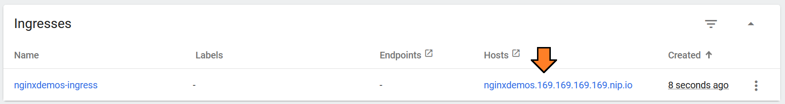
13. In a new browser tab or window, open the high-lighted endpoint from **step 12**.
    ```
    http://nginxdemos.169.169.169.169.nip.io
    ```
    Example:
    > 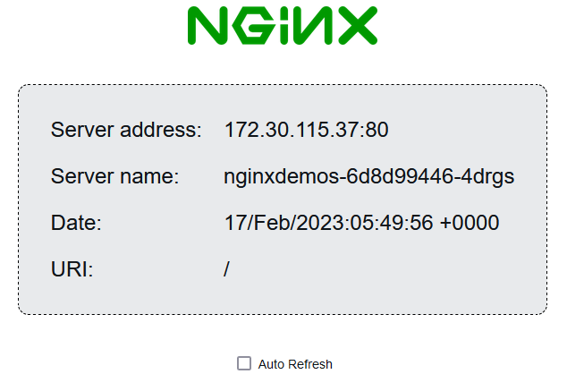
